# Por que um caderno *semântico*?

A semântica estuda o **significado e a relação entre as palavras**. Ela aparece em áreas do conhecimento como linguística, filosofia e ciência da computação.

O objetivo aqui não é ensinar programação, mas decompor termos e expressões relacionadas à computação em partes menores, buscando mapear seus significados.

Para isso, essa página usa um recurso de _[tags](/tags)_, que permite agrupar várias postagens em uma mesma categoria e ainda ter uma página específica para falar sobre o que aquela categoria discute.

Na primeira postagem, foi abordado o conceito **[interface de linha de comando](/tags/ilc)**. Ele é composto de três termos, cada um com significado próprio no ramo da computação:

* **interface:** um componente que faz conexões entre outros componentes
* **linha:** códigos de programação são em linhas, como poesia, e não em parágrafos
* **comando:** uma instrução para ser executada por um interpretador ou compilador

As explicações acima ainda contêm muitos termos que poderiam ser especificados, como *componente*, *código*, *programação*, *interpretador* e *compilador*. 

Estas relações de dependência entre a explicação de um termo e outro formam uma *rede semântica*: uma representação das conexões entre significados e características que os diferenciam ou agrupam:

Estudo técnico: representar e documentar ligações semânticas usando [mermaid-js](https://github.com/mermaid-js/mermaid).
